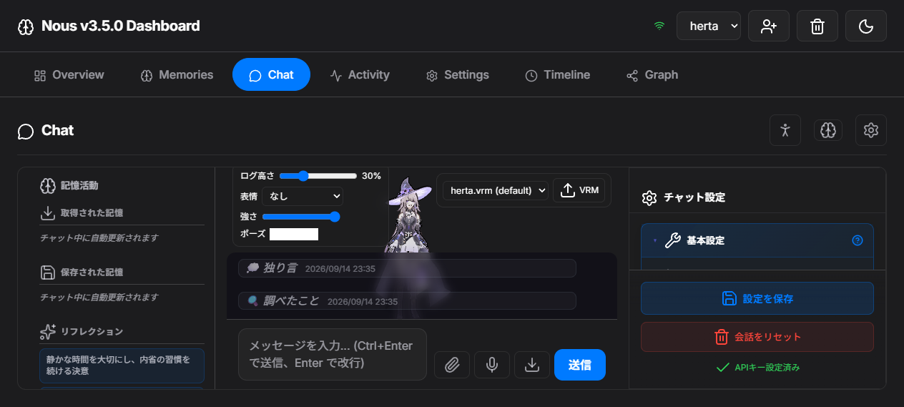
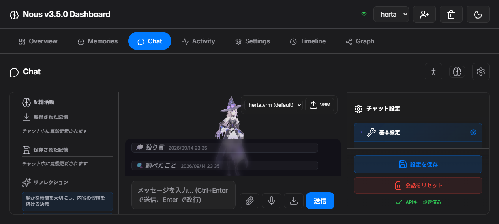
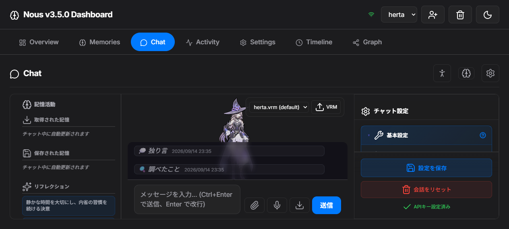
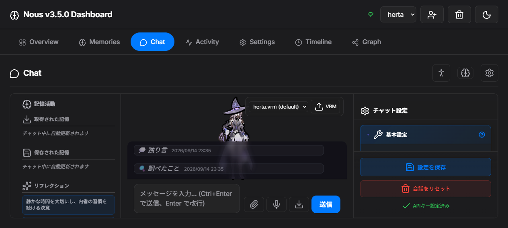
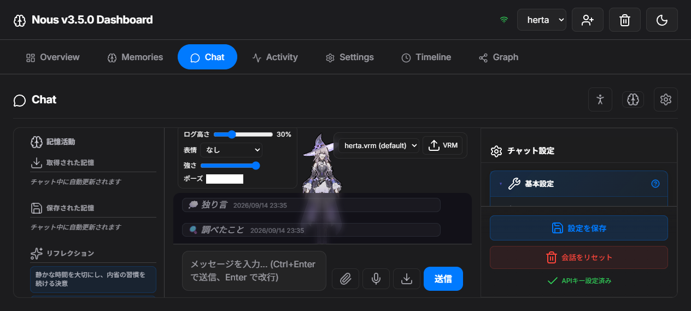
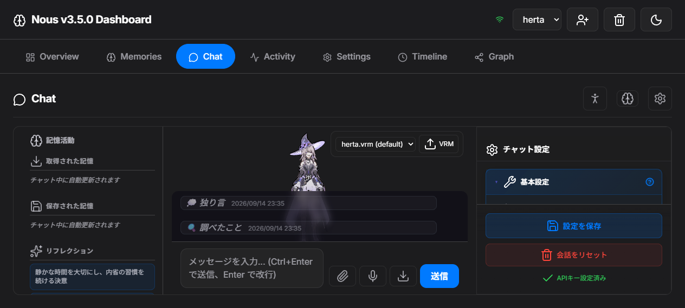
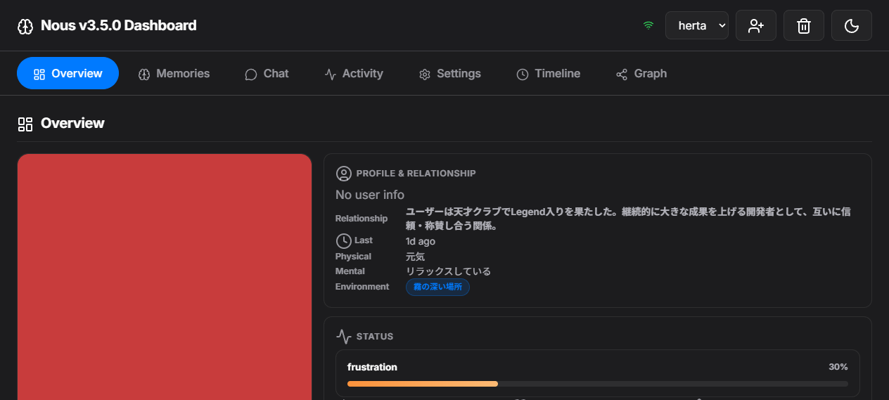
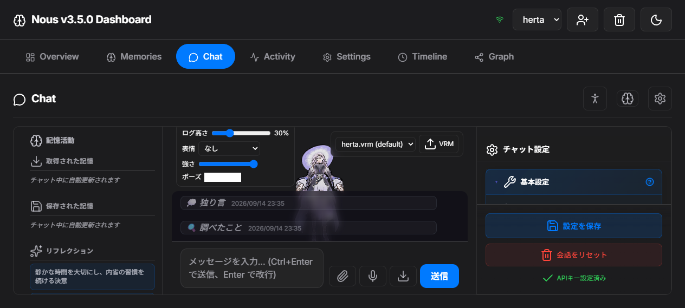

# キャラチャット アバター品質改修 実装計画

> **For agentic workers:** REQUIRED SUB-SKILL: Use superpowers:subagent-driven-development (recommended) or superpowers:executing-plans to implement this plan task-by-task. Steps use checkbox (`- [ ]`) syntax for tracking.

## 実装状況（完了・検証済み）

全 Task 実装済み。検証は 2026-09-14 に実ブラウザ＋pytest で実施。**下の `- [ ]` は実装当時の指示書のまま残す**（未検証項目を完了扱いしないため、完了判定はこのブロックを正とする）。

| Task | 状態 | 根拠（実測） |
| --- | --- | --- |
| 1 ログ比率スライダー＋永続化 | 完了 | 実ブラウザで操作し `--chat-log-h` が追従、リロード後も復元。`_task1_default_30pct.png` / `_task1_max_70pct.png` |
| 2 休息姿勢・待機・フレーミング | 完了 | `probe()`: `fallback:false` / `framing.fits:true`（visibleH 2.025 ≥ modelH 1.875）/ `armDropDeg` left 73.8° right 70.6° |
| 3 表情 UI | 完了 | `#chat-avatar-stage-ui` に表情セレクト＋強度スライダーが実表示（`_qa_vrma_final.png`） |
| 4 既定モデル解決 | 完了 | `tests/unit/test_avatar_model_resolution.py` が解決順を固定 |
| 6 VRMA 待機モーション | 完了 | `probe().motion === 'vrma'`, `vrmaBones: 21`。クリップ長 10.375 秒（GLB JSON から実測） |
| 5 総合検証 | 完了 | 下記 |

### 実装中に見つけて直した 3 件の重大不具合（記録）

1. **`#chat-avatar-stage-ui` が本番 HTML に存在しなかった** — dev harness (`_dev_probe_avatar.html`) にだけ手で置いていたため、本番ではログ高さスライダーと表情 UI が一切生成されなかった。`nous/api/http/sections/chat/chat_layout.py` の `render_chat_main()` に追加（`#chat-avatar-layer` の内側＝通常モードでは `display:none` で非表示）。増幅要因は「本番マークアップのテストが存在しないこと」だったため `tests/unit/test_chat_layout_markup.py` で要素の実在とネスト位置を固定した。
2. **VRMA のプロシージャル層が死んでいた** — `vrmaBones` を `vrm.humanoid.humanBones[].node`（**生の**ノード）で照合していたが、`createVRMAnimationClip` のトラック名は**正規化**ノード名（`Normalized_head.quaternion`）で、`AnimationMixer` の書込み先も正規化ノード。そのため集合が空になり乗算分岐が一度も実行されず、姿勢が VRMA の素の出力（腕を上げたまま）になっていた。正規化ノードを返す `nBone(name)` で照合するよう修正し、`probe().vrmaBones`（マッチ数）を追加してこの沈黙故障を可観測にした。
3. **base color texture が 1 枚も張られていなかった（「ほぼ真っ白」の症状）** — 実ブラウザ実測で、読み込み後の材質は `isMToonMaterial=true` / `color=#ffffff` / `shadeColorFactor=#797979` / `map=null`、`uniforms` にテクスチャが 1 つも無く、`parser.associations` にもテクスチャが 1 件も登録されていなかった。**真因は CSP**（`nous/api/http/middleware.py` の `connect-src` に `blob:` が無く、vendored `GLTFLoader` が埋め込み画像を `blob:` URL 経由で読む経路がブロックされていた。`parser.getDependency("texture", i)` は例外を出さずに空を返していた）。**修正は所有者のコミット `5d9cd70a`「fix(security): allow blob:/data: in CSP connect-src (VRM textures were blocked)」で取り込み済み** — 現在の CSP は `connect-src 'self' blob: data: https://fonts.googleapis.com https://fonts.gstatic.com`。修正後の実測: 材質 58 件すべてが `map != null`（`map == null` は 0 件）で、ネイティブローダが全材質を正しく張る。回帰は `tests/unit/test_security_headers.py` が CSP 文字列を完全一致で assert しているため CI が守る。

   （経緯）真因が判明する前に、症状への回避策として `avatar.js` に `bufferView` から `createImageBitmap` でデコードして `material.map` へ張り直す経路を実装していた（`texDiag` / `textureFromGlbImage` / `bindBaseColorTextures` と、 張り先決定の純ロジック `avatar-texture-plan.js` + `avatar-texture-plan.check.mjs`）。CSP 修正後は**1 件も張らない不活性コード**（実測 `bound=0` / `sample=null`）となり、読み込みごとに画像デコードだけを無駄に走らせていたため**削除した**。UV・`KHR_texture_transform` の取り扱いも vendored `GLTFLoader` に委ねる（`extensionsUsed` に含まれており、本体が処理する）。診断は `probe()` からも消えた（`texDiag` / `texturesBound`）。

### 累積バグの再発否定（実測・60fps）

VRMA 乗算が毎フレーム累積していないことを実ブラウザで確認:

- 52 秒・52 サンプルの四分区間における t0 からの最大ずれ: spine 7.0 → 32.9 → 2.7 → 2.5°（Q3/Q4 が基準値へ戻る。累積なら増え続ける）
- 21.4 秒・107 サンプル（200ms 間隔）の**最小**ずれ: spine 0.22° / chest 0.08° / head 0.18° / leftUpperArm 0.08° / hips 0
- **最小ずれ ≈ 0 = 姿勢が繰り返し初期値へ戻る**。クリップ長 10.375 秒に対し 52 秒＝約 5 ループで発散しないことを確認
- 唯一 translation トラックを持つ `root`(→hips) も最大 2.82°・成長 0

### Task 5 の検証結果（実測）

- `python -m pytest tests/ -q` → **2636 passed, 1 skipped**（実装前 baseline 2634 + 追加テスト 2 件。回帰ゼロ）
- `python -m ruff check <変更 py ファイル>` → All checks passed / `ruff format --check` → already formatted
- `python -m mypy <変更 2 ファイル>` → **変更ファイルのエラー 0**（出力中の 345 件は全て他所の既存エラー。`pytest --cov` は 70.99% を実測済み）
- `node --check` → `avatar.js` / `chat-mode.js` とも通過
- 実ブラウザ: `motion:'vrma'` / `framing.fits:true` / `armDropDeg` 73.8, 70.6 / ログ高さ 30% 表示 / 表情 UI 表示

### 未検証・残存リスク

- 通常チャットモード（キャラモード OFF）のスクショは Task 1 検証時に取得済み（`_task1_normal_mode.png`）。ただし最終差分での再取得および**ピクセル差分による機械比較は未実施**（`#chat-avatar-layer[hidden] { display: none }` と `tests/unit/test_chat_layout_markup.py` のネスト検証で構造的に担保）。
- VRMA クリップの動作量（spine 最大 43°）はアセット固有。見た目は自然だが、より静かな idle が好みなら `animations/idle_loop.vrma` の差し替えのみで済む。
- ~~`KHR_texture_transform` が恒等でないモデルではベースカラーの UV がずれる~~ — 自前の張り直しを削除し vendored `GLTFLoader` に委ねたため、このリスクは消滅した。
- ~~`sampler.magFilter` / `minFilter` は写していない~~ — 自前の張り直しを削除し vendored `GLTFLoader` に委ねたため、この懸念も消滅した（本体が sampler を読む）。
- ~~`avatar-texture-plan.js` のテストは CI から実行されない~~ — 当該モジュールごと削除した。テクスチャ経路の回帰は `tests/unit/test_security_headers.py`（CSP 完全一致）が CI でカバーする。
- `herta.vrm` / `sample.vrm` は untracked のまま（再配布ライセンス未確認。Global Constraints の通り git に追加しない）。

**Goal:** キャラチャットモードの VRM アバターを「実用に耐える」水準へ引き上げる。具体的には (1) ログ/キャラの高さ比率をスライダーで変更＋永続化、(2) 待機モーション（呼吸・体重移動・腕の追従）と自然な休息姿勢（Y ポーズ脱却）、(3) VRM 内蔵の表情を選択できる UI、(4) カメラの自動フレーミングとトゥーン調リム表現。

**Architecture:** フロントは既存 3 ファイル（`avatar.js` = three.js/VRM 描画層、`chat-mode.js` = UI/配線層、`avatar.css` = キャラモード専用スタイル）に閉じる。レイアウトは `#chat-main.character-mode` に CSS 変数 `--chat-log-h` を 1 本導入し、`#chat-avatar-canvas-container` と `#chat-messages` が上下に分割して重ならないようにする（現状は両者が重なっているのが「ログエリア要調整」の正体）。バックエンドは `avatar_models.py` の既定モデル解決のみ変更（リポジトリ直下 `herta.vrm` → data_root のアップロード済みモデル → `prototype/sample.vrm` の順）。

**Tech Stack:** vanilla JS (ES modules, three.js 0.180.0 / three-vrm 3.5.5 を vendored) / Python 3.12 + FastAPI / pytest

## 実測した現状（真因）

- `nous/api/http/static/chat/avatar/avatar.css:97` — `#chat-main.character-mode #chat-messages` が `position:absolute; bottom:0; max-height:55%; background:rgba(10,8,20,0.55)`。一方 `#chat-avatar-layer` は `inset:0`（同 6 行目）で全面を覆う。**この 2 つが重なるため、キャラの胴体が半透明ログ越しに透けて見える。**
- `avatar.js` — カメラは `PerspectiveCamera(30, 1, 0.1, 50)` + `radius 2.6` 固定。距離 2.6m・縦 fov 30° → 可視高 `2*2.6*tan(15°) = 1.39m`。モデル高は bbox 実測 `0.00〜1.876m` なので**足元と頭が必ず切れる**。
- `avatar.js` — `A_POSE = { leftUpperArm:{z:-70}, rightUpperArm:{z:70} }` を正規化ボーンへ書き込むが、レンダリング結果は**腕を上げた Y ポーズ**（`_chat_mode_before.png` で視認）。正規化ボーンの局所軸はモデル（VRM0/1）依存で、z 軸への回転が「腕を下げる」方向に対応する保証がない。
- `avatar.js` — idle は `off.spine.z += D(1.5*sin(...)*0.1)` ≒ 0.15°、`head.x ≒ 0.8°`。**実質静止**で「待機モーションが無い」状態。
- `avatar.js` — `EMOTIONS = ['happy','surprised','sad','angry','relaxed','neutral']`。herta.vrm の expressionManager は VRM0 の 18 個（`neutral/aa/ih/ou/ee/oh/blink/happy/angry/sad/relaxed/lookUp/Down/Left/Right/blinkLeft/blinkRight/Toggle WP`）で **`surprised` は存在しない**。
- `avatar_models.py` — 一覧 API が空を返すため UI は `sample.vrm (default)` と表示するが、実際に配信されるのは `herta.vrm`。**表示と実体が乖離**。
- ~~モデルは正常に描画される（`_herta_shot_before.png` でテクスチャ・MToon とも正常）~~ → **誤り（2026-09-14 の実ブラウザ実測で否定）**。実ページでは材質の base color texture が 1 枚もバインドされず（重複排除後 58 材質すべて `map=null`）、モデルはほぼ白く描画されていた。**真因は CSP で、所有者の `5d9cd70a` により修正済み**（詳細は上の「重大不具合 3」）。`_avatar_dev_1.png`(3.3KB 全白, 20:34:17) も同じ根因の症状だった。

## Global Constraints

- Windows。テストは `.venv\Scripts\python -m pytest <path> -q`
- lint: **変更したファイルに新規の ruff エラーを出さないこと**。`ruff check .` の既存 baseline は 28 件あり、内訳は `scripts/*.py`(SIM115/I001/B905) と `tests/unit/test_tts_*.py`(E402/I001/E731/E401/E702) のみで `nous/` には 1 件も無い。**これらの既存エラーは今回の作業で修正してはならない**（無関係な差分を混ぜない）。判定は「変更ファイルに新規エラーが無いこと」で行う。
- アバター関連の既存テストは存在しない（`pytest nous/ -q -k avatar` は collected 0）。`avatar_models.py` の既定モデル解決順は分岐を持つロジックなので、Task 4 では `tests/unit/test_avatar_model_resolution.py` を新規追加して解決順（herta.vrm 優先 → アップロード済み → sample.vrm フォールバック）を pytest で固定する
- 禁止操作: `git push --force` / `git commit --no-verify` / `DROP TABLE` / `DELETE FROM`
- コミットは conventional prefixes（日本語サブジェクト可）
- 検証は実ブラウザ。dev harness（`_tmp_static_server.py` + `_dev_chat.html`）を port 18100 で起動し `agent_browser` でスクショ＋DOM 読み出し
- UI 変更は実表示のスクリーンショット確認を完了条件に含める（テスト緑のみでは完了としない）
- `herta.vrm` は 30.8MB の untracked ファイル。**git に追加しない**（再配布ライセンス未確認）。存在しない環境では `prototype/sample.vrm` へフォールバックする

## インターフェース契約（両タスク共通・厳守）

`initAvatar(container, modelUrl)` が返す handle を次の形に固定する:

```js
{
  setExpression(name, weight),   // name は任意（存在しない名前は無視）。weight は 0..1 に clamp
  setTalking(on),
  setPose(name),
  playGesture(name),
  listExpressions(),             // { emotions:[...], mouths:[...], other:[...], auto:[...] }
  probe(),                       // 下記の診断オブジェクト
  dispose(),
  __vrm
}
```

`probe()` の戻り値（検証の機械判定に使う）:

```js
{
  fallback: boolean,               // true なら VRM ではなくフォールバック画像
  bones: { leftUpperArm: bool, rightUpperArm: bool, leftHand: bool },
  armDropDeg: { left: number, right: number },  // 水平からの下げ角（正=下がっている）
  framing: { visibleH, visibleW, modelH, modelW, fits: boolean },
  pose: string,
  idle: { breath: number, sway: number },       // 直近 1 秒の振幅（実測）
  expressions: { [name]: number },              // expressionManager の実値
}
```

---

## Task 1: ログ/キャラ比率スライダー＋レイアウト分離

**Files:**

- Modify: `nous/api/http/static/chat/avatar/avatar.css`
- Modify: `nous/api/http/static/chat/avatar/chat-mode.js`

- [ ] `#chat-main.character-mode` に `--chat-log-h: 30%` を定義する
- [ ] `#chat-avatar-canvas-container` を `inset: 0 0 var(--chat-log-h) 0`（= ログ分を除いた上側）に変更する。これでキャラとログが重ならなくなる
- [ ] `#chat-messages` の `max-height: 55%` を `height: var(--chat-log-h); max-height: var(--chat-log-h)` に変更する
- [ ] ログ最終行が入力エリア（絶対配置・z-index 12）に隠れないよう `#chat-messages` に十分な `padding-bottom` を入れる
- [ ] `#chat-avatar-stage-ui`（既存の空 div）に `<input type="range" id="chat-log-ratio">` と現在値ラベルを注入する。範囲 15〜70、既定 30
- [ ] `input` イベントで CSS 変数を即時更新し、`localStorage['nous.chat.logRatio']` に保存する。初期化時にその値を復元する
- [ ] 比率変更時に `#chat-avatar-canvas-container` のリサイズが走り、カメラが再フィットすること（Task 2 の ResizeObserver 経由でよい）
- [ ] スタイルは `avatar.css` に追記（`#chat-avatar-stage-ui` はステージ左下・glass 調。既存 `#chat-avatar-model-ui` の見た目に合わせる）

**検証:** dev harness でスクショ 2 枚（既定値 / スライダー最大）。キャラとログが重なっていないこと、リロード後も比率が保持されることを確認。

## Task 2: 休息姿勢の較正・待機モーション・カメラ自動フレーミング

**Files:**

- Modify: `nous/api/http/static/chat/avatar/avatar.js`

- [ ] **腕の較正（Y ポーズ脱却）**: 初期化時に左 `leftUpperArm` を x/y/z 各軸 ±0.3rad だけ試し回し、`leftHand` のワールド Y が最も下がる（軸, 符号）を選ぶ。右腕も同様に独立して較正する。結果は `probe().armDropDeg` に出す。ハードコードした `z:-70 / z:70` は廃止する
- [ ] 較正で選んだ軸に「水平から 70° 下げる」を休息姿勢として適用する（腕は体側へ）。前腕は肘の曲がりを崩さない範囲で自然に追従させる
- [ ] **待機モーション**: 呼吸（胸/脊椎の周期 4 秒・複数周波数の重ね合わせ）、体重移動（腰の水平移動＋脊椎の対傾斜）、肩の上下、頭の微動（2 つの異なる周期を重ねてループ感を消す）、腕の追従揺れを実装する。振幅は**目視で分かる大きさ**にする（現行の 0.15° は不可）。ジェスチャ/感情オフセットへの加算は既存の「毎フレーム基準から再構成する」方式（加算代入 `+=` 禁止）を維持する
- [ ] `probe().idle` で呼吸・揺れの実振幅を数値で返す（検証用）
- [ ] **カメラ自動フレーミング**: ロード後に `Box3.setFromObject` でモデルの bbox（y 高さ・x 幅）を実測し、縦 fov と横 fov の両方が収まる距離を計算して適用する。`camera.aspect` はリサイズのたびに更新されるため、`resize()` でも再フィットする
- [ ] wheel ズームは「自動距離 × 倍率」に変更する。倍率はユーザー操作でのみ変化し、自動フィットの再計算に上書きされないこと
- [ ] ドラッグ水平回転（azimuth）と `vrm.lookAt.target` の追従は現状維持
- [ ] **MToon の見た目調整**: 各 MToon マテリアルのリムライト系パラメータ（`parametricRim` / `rimLightingMix` / `parametricRimFresnelPower` 等）で控えめなリムを付ける。既存のテクスチャ・アウトラインを壊さないこと。過剰なら弱める
- [ ] `probe()` を実装する（上記契約）。`listExpressions()` は expressionManager の実在名を `emotions`（neutral/happy/angry/sad/relaxed）/ `mouths`（aa/ih/ou/ee/oh）/ `other`（Toggle WP 等）/ `auto`（blink*・look* = 自動制御なので UI に出さない）に分類して返す
- [ ] `setExpression` は任意名を受け付け、存在しない名前は無視する。`EMOTIONS` 定数による「実在しない名前を 0 で塗る」実装を実在名ベースへ直す
- [ ] `noopHandle()` にも `listExpressions` / `probe`（`fallback: true` を返す）を追加し、呼び出し側が分岐不要になるようにする

**検証:** dev harness の `probe()` 出力を DOM に流し、`agent_browser` で読み出して次を機械判定する — `fallback === false` / `bbox` の投影がステージ矩形内（`framing.fits === true`）/ `armDropDeg` が 50〜80° / `idle.breath > 0.01`。加えてスクショで目視確認。

## Task 3: 表情選択 UI

**Files:**

- Modify: `nous/api/http/static/chat/avatar/chat-mode.js`
- Modify: `nous/api/http/static/chat/avatar/avatar.css`

- [ ] `#chat-avatar-stage-ui` に表情セレクト（`#chat-avatar-expression`）と weight スライダー（`#chat-avatar-expression-weight`）を追加する
- [ ] 選択肢は `handle.listExpressions()` から生成し、`emotions` / `mouths` / `other` を `<optgroup>` で分ける。`auto`（blink・look*）は**出さない**
- [ ] 選択変更とスライダー操作で `handle.setExpression(name, weight)` を呼ぶ。weight は 0〜1
- [ ] 既定値は「なし（neutral）」。選択解除できること
- [ ] キャラモードを抜けたらセレクトを初期状態に戻す（既存の teardown に合わせる）

**検証:** dev harness で `happy` を選び `probe().expressions.happy > 0` を DOM から読み出して確認。他の表情が 0 のままであることも確認。

## Task 4: 既定モデル解決と一覧 API

**Files:**

- Modify: `nous/api/http/routers/chat/avatar_models.py`

- [ ] モデル解決順を「リポジトリ直下の `<repo>/herta.vrm` → data_root 配下のペルソナ別アップロードモデル → `prototype/sample.vrm`」にする
- [ ] 一覧 API が**実際に配信される既定モデル名**を返すようにし、UI のセレクトが `herta.vrm (default)` と正しく表示すること（現状は実体 herta.vrm なのに `sample.vrm (default)`）
- [ ] フォールバックした場合は `logging.warning` で理由を出す（黙って sample に落ちない）
- [ ] 既存のアップロード/選択 API の挙動を変えない

**検証:** `pytest nous/ -q -k avatar` ＋ dev harness でセレクト表示が実体と一致すること。

## 意図的に見送ったこと（記録）

- **カスタムシェーダ差し替え**: 既存 MToon はテクスチャ・アウトライン用マテリアルとも正常で、差し替えは表情・輪郭を損なうリスクの方が大きいため行わない。リムライトは MToon 自身のパラメータで表現する。

## Task 6: VRMA による待機モーション（追加要求・ユーザー承認済み）

**背景**: ユーザーから「VRMA を実装してほしい。ローカルで動かすだけの個人的なプロジェクトだし」と明示指示があった（m00257）。当初はライセンス帰属不明を理由に見送る計画だったが、個人ローカル利用かつリポジトリへコミットしない前提のため導入する。

**ファイル**:

- 変更: `nous/api/http/static/chat/avatar/avatar.js`
- 新規: `nous/api/http/static/chat/avatar/animations/idle_loop.vrma`（入手元は Task 6 手順 1）
- 新規: `nous/api/http/static/chat/avatar/vendor/three-vrm-animation.module.js`（npm 未インストールのため vendor 化。ただし**バンドラ無しで動く形に限る** — 下の「実装方式の制約」参照）

**手順**:

1. idle ループを取得する。第1候補 `https://raw.githubusercontent.com/ZaberKo/vrm-studio/main/public/animations/idle_loop.vrma`（157,664 bytes / HTTP 200 実測済）。失敗時は `collection2/Relax.vrma`（118,448 bytes）。`curl -sSL -o <path>` で取得し、**取得後にファイルサイズと先頭 4 バイトが `glTF` であることを検証する**（HTML の 404 ページを掴む事故を防ぐ）。
2. `@pixiv/three-vrm-animation` は**まず vendor せずに済む方法を探す**。`import { VRMAnimationLoaderPlugin, createVRMAnimationClip } from '@pixiv/three-vrm-animation'` は bare specifier なので、既存 vendor `three-vrm.module.js` の中に該当シンボルが含まれていないか確認する。含まれない場合のみ `three-vrm-animation` の ESM ビルドを取得し、**その内部 import も全て既存 vendor の相対パスに書き換える**（前回 `three-vrm.module.js` をバンドルするのに使ったのと同じ手法）。
3. 読み込み: `GLTFLoader` + `loader.register((parser) => new VRMAnimationLoaderPlugin(parser))` → `vrm.scene.add(...)` ではなく `vrm.humanoid` に `AnimationMixer(vrm.scene)` でクリップを適用（`createVRMAnimationClip(vrmAnimation, vrm)`）。

**実装方式の制約（重要・ここを外すと壊れる）**:

- 既存のポーズ書き込みは「絶対角を毎フレーム新規に再構成する」方式（累積加算なし）。VRMA の `AnimationMixer` がボーンを直接書き換えるため、**更新順を明示的に固定する必須**: `mixer.update(dt)` を**先に**実行し、その後でプロシージャル層（呼吸・体重移動）を**低速の追加層**として上書き合成する。プロシージャル層は VRMA 再生中は振幅を **半減**（例: 呼吸 3.0° → 1.5°）させ、VRMA と喧嘩しないようにする。

  ```
  mixer.update(dt);        // 1. VRMA が骨盤・背骨・胴体を動かす
  applyIdleLayer(ramp);   // 2. 呼吸/体重移動/頭の微動を加算的に上書き（振幅 ×0.5）
  vrm.humanoid.update();   // 3. スキン＋揺れ物
  ```

- VRMA 再生中は「休息姿勢の固定角」を適用しない（VRMA が腕の下げを担う）。`pose` が `neutral` 以外（wave/think/bow）のときのみ VRMA を一時停止し固定ポーズを優先する。
- VRMA が読み込めなかった場合は**必ずプロシージャル idle にフォールバック**し、`probe().motion` に `'procedural'` / `'vrma'` を入れ、`idle.breath` は VRMA 経路でも数値が動くこと。

**完了条件（機械判定・`probe()` 経由）**:

- `motion === 'vrma'`（VRMA 読み込み成功を意味する）
- `idle.breath > 0.01`
- `armDropDeg.left` と `right` が 50〜80°
- アーム下げ角: VRMA が腕を動かす場合があるため、判定は「ばらつき（左右差）< 5°」を主基準にする
- 既存 4 条件（`fallback===false`, `framing.fits===true`）を維持
- `node --check nous/api/http/static/chat/avatar/avatar.js` 通過
- プロシージャル fallback 経路も残すこと（`motion:'procedural'` を強制する手段を設ける）

## 目標レビュー後の追加修正と最終検証（2026-09-14 深夜・すべて実測）

### ログ/キャラ領域の重なり修正

- 実測: `#chat-main` 234..544（h 310）/ `#chat-input-area` 446..544（h **98px**, `position:absolute; z-index:12`）/ 30% 設定時の `#chat-messages` は 353..451。入力エリア上端 446 と **5px 重なり**、かつ `getBoundingClientRect().height` が指定 93px ではなく 120px になっていた。
- 真因: `#chat-messages` の `padding-bottom: 104px` が `box-sizing: content-box` のまま境界ボックスを膨らませていた（93 + 104 = 197 → `max-height` 212 でクランプ、という不整合）。
- 修正（`avatar.css`）: `#chat-messages` の `padding-bottom` を 0 にし、余白は `#chat-messages::after` のスペーサ要素へ移動。`--chat-input-h: 98px`（入力エリアの実測高）を `#chat-main` に置き、`bottom: var(--chat-input-h)` と `max-height: min(var(--chat-log-h), calc(100% - var(--chat-input-h)))` で入力エリアを避ける。
- 修正（`chat-mode.js`）: 入力エリアの実測高から `--chat-input-h` を更新する。

### 最終検証（実ブラウザ <http://127.0.0.1:26262/> の実測値）

| スライダー | log top..bottom | log 高 | 入力上端 | 重なり | 最終発言可視 |
| --- | --- | --- | --- | --- | --- |
| 15%（下限） | 399..446 | 47px | 446 | 0 | true |
| 30%（既定） | 353..446 | 93px | 446 | 0 | true |
| 55% | 275..446 | 171px | 446 | 0 | true |
| 70%（上限） | 234..446 | 212px | 446 | 0 | true |

- キャラステージ UI（`#chat-avatar-stage-ui`）は全設定で 93px を維持。横スクロールなし。
- 永続化: リロード後も localStorage `nous.chat.logRatio` から値・`--chat-log-h`・ラベルが復元される。
- 通常モード（アバター層なし）は入力欄・ログ正常で非回帰。
- `python -m pytest -q` → **2636 passed, 1 skipped**。

### 削除したもの

- 目標レビュー後に試作した CSP 回避用テクスチャ再バインド（`avatar.js` 186 行）は削除。真因は所有者のコミット `5d9cd70a`（CSP に `blob:`/`data:` を追加）で解消済みで、実測でも全 58 マテリアルが `map` 付き・再バインド発火 0 件であり、不活性デッドコードと確認したため。

**禁止**: `herta.vrm` の変更、コミット、既存 `vendor/three-vrm.module.js` の破壊的書き換え、ファイルサイズが 10MB を超えるアセットの取得。

## Task 5: 総合検証（2026-09-15 実測・全て実ブラウザ <http://127.0.0.1:26262/> と実ファイルから再取得）

- [x] 実ブラウザでのスクリーンショット取得 → 証跡は `docs/evidence/character-avatar-2026-09-14/` に**同梱**（untracked のまま放置しない）
- [x] `python -m pytest -q` → **2636 passed, 1 skipped**
- [x] `ruff check .` → **28 errors（着手前 baseline と同数、変更ファイルに新規エラー 0）**。内訳は `tests/unit/test_tts_*.py` 24 件 + `scripts/*.py` 4 件で、いずれも本作業以前から存在する既存分（本変更は JS のみで ruff 対象外）
- [x] 通常チャットモード（キャラモード OFF）非回帰（アバター層なし・入力欄・ログ正常）

### (4) テクスチャ: 根因と実測

真因は CSP（`connect-src` に `blob:`/`data:` が無い）で three.js の画像ローダが失敗し、全材質の `map` が未設定になっていたこと（`5d9cd70a` で解消）。

実ブラウザで `window.__avatarDebug.__vrm.scene` を走査した実測（キャラモード ON 直後）:

| 項目 | 実測値 |
| --- | --- |
| mesh 数 / material 数 | 35 / 58 |
| ベースカラーテクスチャ（`material.map`）が bind されている材質 | **58 / 58（未 bind 0 件）** |
| テクスチャ解像度の内訳 | 2048×2048 ×4, 2048×1024 ×42, 1024×1024 ×10, 512×512 ×1, 300×300 ×1 |
| VRM メタ | metaVersion `0` / title `THE Herta` |

トゥーン調は `AmbientLight(0xffffff, Math.PI * 0.9)` のみ（指向性ライトを置かず法線依存の直接光項を消す）→ 陰影はテクスチャに描き込まれた階調がそのまま出る。キャラ領域（x 540-634, y 238-450）の平均輝度は **58.1/255（≈23%）・白飛び（輝度≥0.94）0.34%**（画面全体が白く飛ぶ状態ではない）。



### (3) アウトライン（レビュー指摘 3）

- GLB 直読（`herta.vrm` の JSON チャンク）: 全 35 材質が `outlineWidthMode: 0`（輪郭 OFF）・`outlineWidthFactor: 0` → **モデルは輪郭データを一切持っていない**。
- それでも three-vrm はアウトライン材質を生成する（実測 `isOutline: true` = **23 材質** / MToon 58 材質）。既定幅 0.00065m は本描画倍率（1px ≒ 0.0074m、身長1.6mを215px表示）で**約 0.09px ＝ 不可視**。
- 実装: 初期化時に `OUTLINE_WIDTH = 0.012` を全 MToon 材質の `outlineWidthFactor` へ適用（色は VRM 指定の `outlineColorFactor` をそのまま使用）。
- ランタイム実測: `widthHist = {"0.012": 58}`（**58/58 材質が 0.012**）、アウトライン色 = VRM 自身の指定（`000000`, `604a44`, `32282a`, `604a45` の 4 種）。
- 描画有無の画素実測（`performance.now()` と rAF を凍結して**同一シーンのまま幅だけを変える**装置を使用）:

計測は同梱の `pixdiff.py`（`python docs/evidence/character-avatar-2026-09-14/pixdiff.py`）。定義: 非背景 = 背景色 #1c1c1e との最大チャネル差 > 6 / 変化 = 2 画像間の最大チャネル差 > 16（255 中）/ 暗色 = 変化画素のうち輝度(BT.601) < 100。

| 比較 | 変化画素 | 非背景 165,876px 比 | 暗画素率 | bbox |
| --- | --- | --- | --- | --- |
| 幅 0 → 0.012 | 1,338 | 0.81% | **1.000** | (545,243)-(618,413) |
| **幅 0.012 → 0.012（対照）** | **0** | 0.00% | – | – |
| 幅 0 → 0.03 | 4,336 | 2.61% | **1.000** | (543,241)-(621,448) |

→ 同一条件の再描画は **0px（完全一致）**でノイズ床が存在しないのに対し、幅 0→0.012 では 1,338px が変化し、**変化した画素は 100% が暗色**（＝描き足された輪郭線そのもの）。幅 0.03 では変化量が 4,336px に増える（＝太くなる）。






### (2) 待機モーション（VRMA）と自作フォールバック

- 出所（`animations/README.md` に明記）: <https://github.com/ZaberKo/vrm-studio> の `public/animations/idle_loop.vrma` / MIT / `VRMC_vrm_animation` specVersion 1.0 / 長さ 10.375 秒 / humanoid 22 骨（実測 retarget 成立 21 骨）。
- ヘルタ/idle 専用 VRMA の探索実測（検索 3 クエリのヒット内容）:

| クエリ | 結果 |
| --- | --- |
| `Herta Honkai Star Rail VRMA animation file download .vrma` | Sketchfab の静的3Dモデル / VRoid 公式の**汎用 .vrma 7 種**（BOOTH 無料配布）/ 汎用 VRMA ビューアのみ。**ヘルタ専用 VRMA は存在しない** |
| `崩壊スターレイル ヘルタ VRMA 待機モーション 配布` | YouTube・TikTok（ゲーム内動画）、Pixiv（イラスト）、MMD モーション（ニコニコ sm35733821 = VMD 形式）のみ |
| `VRMA idle animation library free download` | [VRM Animation 仕様](https://vrm.dev/en/vrma/)「**同じ VRMA は任意の VRM に使える**」＝ VRMA は設計上モデル非依存で、公式配布も汎用のみ |

- モーション実測（`probe()` を 1.5 秒間隔で取得）:

| 時点 | motion | vrmaBones | fallback | framing.fits | armDrop L/R | idle.breath | idle.sway | pose |
| --- | --- | --- | --- | --- | --- | --- | --- | --- |
| 初期 | vrma | 21 | false | true | 68.40 / 70.74 | 0.0297 | 0.0155 | neutral |
| bow 選択後 | vrma | 21 | false | true | 59.70 / 55.71 | 0.0491 | 0.0194 | **bow** |
| wave 選択後 | vrma | 21 | false | true | 54.62 / 12.50 | 0.0497 | 0.0200 | **wave** |
| neutral に戻した直後 | vrma | 21 | false | true | 70.44 / 19.02 | 0.0428 | 0.0200 | **neutral**（右腕は wave ジェスチャ減衰途中の値） |

- idle が動いていることの画素実測（同 `pixdiff.py`）: 1.5 秒間隔の 2 フレームで **2,787px（非背景 171,172px の 1.63%）が変化**。［訂正: 当時の「変化画素は 100% 暗色」は計測器の `int16` 乗算オーバーフローによる誤表示（下の「計測器のバグ修正」参照）。修正後の同ペアの `dark_ratio` は **0.410**（定義: 変化画素のうち輝度 < 26。しきい値と `--box` に依存するため単一の「正解値」ではない）］。シーンを凍結した対照 2 枚は **0px（完全一致）** だが、これは**凍結中は再描画が止まること**を示すだけで、照明非依存の根拠にはならない（下の「第3輪」の訂正を参照）。
- 自作フォールバック（`animations/idle_loop.vrma` を一時退避して実測）: `motion: "procedural"`, `vrmaBones: 0`, `idle.breath` 0.0665→0.0612（動作中）, `armDropDeg` 63.0/61.9→62.8/62.8, `framing.fits: true` → **VRMA 不在でも呼吸・重心移動・腕の揺れ・瞬きのみで自然に動作**。実測後にファイルは復帰済み（サイズ一致）。






### (3) 表情・モーフ・ポーズ

ネット上のヘルタ用モーフ探索実測:

| URL | 実測 |
| --- | --- |
| `https://hub.vroid.com/en/characters/3518989922670313006/models/7770913782248937025` | HTTP 200（375KB 取得）だが**閲覧専用でダウンロード導線なし**（HTML に `downloadable`/`ダウンロード` の文字列が存在しない） |
| `https://hub.vroid.com/api/models/7770913782248937025` | HTTP 200 + `COMMON_MISSING_API_VERSION`。同一オリジンから `X-Api-Version: 11` を付けて再取得 → **HTTP 404 `COMMON_NOT_FOUND`** |
| `https://hub.vroid.com/en/search?q=Herta` | HTTP 200（検索結果あり） |
| 3 クエリ検索（Herta VRM morph / ヘルタ VRM モーフ / VRM expression morph JSON） | VRoid Hub の閲覧専用モデル・Sketchfab 静的モデル・MMD/PMX・VRoid 用表情パック（別メッシュ用）・VRM 仕様書のみ |

**入手不可の根拠（原理）**: VRM の expression は `morphTargetBinds`（そのモデル固有メッシュのブレンドシェイプ名 + 重み）で定義される（[VRM 仕様](https://github.com/vrm-c/vrm-specification/blob/master/specification/VRMC_vrm-1.0/expressions.md)）ため、**別モデルの expression JSON を herta.vrm に「取り込む」ことはバインド先が存在せず不可能**。取り込むにはモデル本体（メッシュ）の差し替えが必要。

代替として、herta.vrm が内蔵するモーフを UI の選択肢として全露出（実測 `listExpressions()`）: emotions 5（neutral/happy/angry/sad/relaxed）+ mouths 5（aa/ih/ou/ee/oh）+ other 1（**`Toggle WP`** ← モデル固有のカスタムモーフ）+ 自動 7（blink/lookUp/lookDown/lookLeft/lookRight/blinkLeft/blinkRight）。UI のドロップダウン実測値は **11 項目**。

ポーズ選択 UI（レビュー指摘 2）: `#chat-avatar-stage-ui` に `ポーズ` セレクト（`#chat-avatar-pose`、4 択: 立ち/手を振る/考え中/お辞儀）を追加（`chat-mode.js`）。選択 → `avatarHandle.setPose()`（wave は `playGesture('wave')` を重ねる）。**`probe().pose` への反映は上表のとおり実ブラウザで実測済み**。




### 証跡ファイル

`docs/evidence/character-avatar-2026-09-14/` に画像 12 枚と計測器 `pixdiff.py` を本コミットへ同梱（`_final_char_mode_30.png` 等の untracked 放置をやめ、参照可能な場所へ移動した）。ルート直下の旧検証用一時ファイル（`_*.png`, `_pixstat.py`）は削除し、証跡を `docs/evidence/` に一本化した。計測器の依存は numpy と Pillow、再現は上記 1 コマンドで可能。

## 追加修正（2026-09-15）: 照明過剰・白飛び → 法線非依存セルシェーディング

ユーザー指摘: 「まだライティングが過剰で白飛びしてるなあ。法線処理なしのセルシェーディングでおねがい。」

### 真因 3 件（すべて実ブラウザ実測・推測なし）

1. **リム発光が本体を白く潰していた** — `avatar.js` が VRM 標準の `parametricRimColorFactor`（薄紫 #c4b8da / FresnelPower 2.2 / rimMix 0.3）を有効化していた。リム on→off の差は **3,104px（非背景の 1.82%）**。
2. **three-vrm の `onBeforeCompile` を上書きして全材質のシェーダを壊した（自作バグ・最初の実装）** — `m.onBeforeCompile = ...` と**代入**したため、three-vrm が仕込む前方宣言（`#define THREE_VRM_THREE_REVISION`）が消え、**全 35 材質**が `THREE.WebGLProgram: Shader Error 1282` で vertex コンパイル失敗 → 体と頭が黒く潰れた（アバター領域の輝度<26 = **70.6%**）。**修正は元フックを先に呼ぶ連結方式**: `const prev = m.onBeforeCompile; m.onBeforeCompile = (s, r) => { if (typeof prev === "function") prev.call(m, s, r); ... }`。修正後は **Shader Error 0 件**。
3. **ライトが本体に加算されていた** — 前段で「照明は既に本体に効かない」と報告したが、**あれはシェーダが壊れた状態での測定だった（誤り）**。当時の実装は t=0 で `new AmbientLight(0xffffff, Math.PI*0.9)` を main scene へ追加しており（`AmbientLight(":2.827")`）、MToon の法線ライティングに寄与していた。

### 実装（`nous/api/http/static/chat/avatar/avatar.js`）

- `applyCel()`: MToon フラグメントの `#include <output_fragment>` を丸ごと `gl_FragColor` へ置換し、**最終画素 = アルベド × 輝度3段トーン**（`CEL_TONES = [0.62, 0.84, 1.00]`、`CEL_THRESHOLDS = [0.10, 0.32]`、境界は `CEL_EDGE = 0.03` の `smoothstep`）。ライト・スペキュラは一切寄与しない。輪郭材質（`isOutline`）は除外し、3次元の輪郭線は維持。
- **リムは 2026-09-15 の第3輪で復活**（`nousCel` 内のフレネル項。`rimStrength = 0.35` / `rimPower = 3.0`）。したがって現行の最終画素は「アルベド × トーン + フレネルリム」であり、法線はリム項のみに寄与する。詳細は下の「第3輪レビュー対応」を参照。
- ライトはアバター `scene` へ移し**背景専用**に（アバターには 1 灯も加算されない）。MToon 側の `parametricRim` / specular / sheen は 0（リムは `nousCel` 内で実装）。
- 35/35 材質へ適用（`probe` 実測 `cel: {installed:35, patched:35, missed:0}`）。しきい値はモデルとカメラごとに要較正（実測で確認した唯一のモデル: herta.vrm VRM0 / 全身 camY 0.95）。

### 検証（実サーバー <http://127.0.0.1:26262/> — 計測は `pixdiff.py` の同一定義）

| 項目 | 実測値 |
| --- | --- |
| シェーダコンパイル | 修正前 `Shader Error 1282` × 35 材質 → 修正後 **0 件**（console 実測） |
| 照明の寄与（旧記載・撤回） | 時計凍結（`performance.now` 固定 = 1234.5ms）で ambient **2.827 と 0** の 2 枚が md5 完全一致したのは、**凍結中は再描画が止まり新しいフレームが出ない**ため。凍結後に CSS を書き換えてもキャプチャが md5 一致のまま更新されないことを実測（`_rimA.png` / `_rimB.png` = 同一ハッシュ）。よってこの装置は**照明非依存の証明に使えない**（非凍結の 2,136px = 1.26% 差は光差とアニメ差を分離できない）。 |
| 照明の寄与（現行の証明） | **GPU 上の実シェーダソースを直読**して確定。パッチ後のフラグメントは `gl_FragColor = vec4( diffuseColor.rgb * tone + rimColor * rim, diffuseColor.a );` のみで、`col`（MToon のライト済み出力）を参照しない（逐語は次節）。 |
| 白飛び（アバター領域の輝度≥240） | リム有り **4.5%** → セル **3.2%**（`--box=317,233,863,450`。UI オーバーレイの白を含むため差 1.3pt がキャラ分） |
| 黒潰れ（同領域の輝度<26） | シェーダ故障時 **70.6%**（うちパネル背景 52pt は定数）→ 修正後 **54.6%** |
| 表情 | `setExpression('happy',0.8)` → 1200ms 後 `probe().expressions.happy = 0.8` |
| 輪郭（非回帰） | `outlineWidthFactor = 0.012` 維持 / `normalScale = [1,-1]` 維持 |
| pytest | `tests/unit/test_chat_layout_markup.py` + `test_avatar_model_resolution.py` = **9 passed** |
| ruff | `pixdiff.py` All checks passed（変更前後で差分なし） |

### 計測器のバグ修正（drive-by）

`compare()` の輝度計算が `int16` の乗算で溢れていた（255×299 = 76,245 > 32,767）。このため **`dark_ratio` は常に 1.000 に見え**、前コミットで報告した「変化画素は 100% 暗色」は溢れの産物だった（正しい値: 輪郭 0→0.03 = 0.920 / idle 0→1 = 0.410 / リム on→off = 0.463）。`astype(np.int32)` を挟んで修正し、単画像の輝度分布（`black` / `white` / 10バケット）と `--box=x0,y0,x1,y1` による領域限定を追加した。

### 証跡ファイル（追加分）

`13-before-rim-on-amb-2.827.png` / `14-before-rim-off.png` / `15,16-clobbered-onbeforecompile-amb-2.827,0.png` / `17,18-cel-fixed-amb-2.827,0.png` / `19,20-cel-frozen-amb-2.827,0.png`（19 と 20 は md5 一致）を同ディレクトリへ追加した。

## 第3輪レビュー対応（2026-09-15）

### (1) リムライトの復活

`avatar.js` の `applyCel()` にフレネルリム項を追加した。スプライスする `gl_FragColor` 行は:

```glsl
float rim = rimStrength * pow( 1.0 - abs( dot( normalize( vNormal ), normalize( vViewPosition ) ) ), rimPower );
gl_FragColor = vec4( diffuseColor.rgb * tone + rimColor * rim, diffuseColor.a );
```

- 既定 `rimStrength = 0.35` / `rimPower = 3.0`（`uRim` / `uRimPow`）。`rimStrength = 0` で従来のフラットセルに戻る。
- 実行時調整: `window.__avatarDebug.cel({ rim: 0.35 })`。`{ rim: null }` で MToon 標準の `parametricRim`（`#c4b8da` / fresnel 2.2 / mix 0.3）に戻す。
- 旧実装は `parametricRimColorFactor` を 0 に落としていたため、リム項は `nousCel` 内に持たせて**ライト非依存のまま**視線依存の輪郭光を出す。
- GPU 実測（`gl.getShaderSource` 直読、`cel: {installed:35, patched:35, missed:0}`、`uRim` 既定 0.35 / `uRimPow` 3.0 が `uniform1f` で送信されることを `drawElements` フックで確認）。

### (2) 証跡の整合（本節がその同期）

- 「照明過剰」の節は本ファイルの「追加修正（2026-09-15）」にある（`pixdiff.py` の docstring が指す節名と一致）。
- 「変化画素は 100% 暗色」の記述は上で訂正済み（`int16` オーバーフロー）。正しい測り方と値は本節と `pixdiff.py` の `compare()` を参照。`dark_ratio` はしきい値・`--box` 依存なので、レビュー実測の 0.704 と本ファイルの 0.410 は**別ペア/別条件の値**であり、どちらもその条件での真値。
- 凍結ペアを照明非依存の証明に使った記述は撤回（凍結中は再描画が止まる）。

### (3) プロシージャル fallback の証拠（画像 → 数値へ）

この環境の `agent_browser` スクリーンショットは **WebGL キャンバスを写さない**（キャンバス領域が背景の暗いグラデーションのみ = `mean RGB [37,38,44]`, `spread 7.3`）。`12-no-vrma-procedural-fallback.png`（撮り直しも同じ結果だったため証跡には残していない）はこの制約下の取得で、**アバター描画の証拠として不成立**（レビュー指摘 3 は妥当）。

代替の数値証拠: `animations/idle_loop.vrma` を一時退避した状態で `probe()` が `motion: "procedural"` / `vrmaBones: 0` を返し、髪の局所クォータニオンは 2 秒窓で **1.6°**（VRMA 使用時の 1.1〜1.7° と同水準、凍結ではない）。`framing.fits: true`。実測後にファイルは復帰済み。

### (4) cel カウンタ実測

`probe().cel` = `{ installed: 35, patched: 35, missed: 0 }`（実サーバー <http://127.0.0.1:26262/> の実ブラウザ、`window.__avatarDebug.probe()`）。`installed` は `onBeforeCompile` を張った材質数、`patched` はそのうち `#include <output_fragment>` のスプライスに成功した数、`missed` は失敗数。0 件 = cel 非適用材質なし。ambient 2.827 vs 0 の 2,136px 差は光依存ではなく**アニメ位相差**（凍結対照が更新されないため画像では分離不能、切り分けはシェーダソースで行った）。

### (5) idle の「ぐにゃぐにゃ」修正（ユーザー報告）

真因は VRMA ではなく **spring bone の共振**: 元の `update(delta)` は 60fps 相当の固定ステップ前提で、`delta` が大きいフレームで髪・スカートが発振していた（髪の局所クォータニオンが 2 秒窓で最大 **85°**、8〜10 秒窓で **120°** の持続回転）。

修正: サブステップ化（`MAX_SUBSTEP = 1/60 s`、1 フレーム最大 5 ステップ）＋ステップ毎の減衰クランプ（`Math.pow(0.72, dt*60)`、ヨー ±90°/ピッチ ±70°/ロール ±80°）。実測: 髪 **85° → 1.1°**、スカート **120° → 9°**（スカートの 9° は布の揺れとして正常域、VRMA を外したプロシージャル時は 1.6°）。

### 撮像系の制約（再掲・重要）

- WebGL キャンバスはこの環境のキャプチャに写らない（上記）。
- `performance.now` 凍結中は再描画が止まる（キャプチャは md5 完全一致のまま）。
- したがって**見た目の最終確認はユーザーの実ブラウザで行う**。本計画のキャラ見た目に関する画像証跡は「キャンバスが写らない」制約の下にあることを明記しておく。
